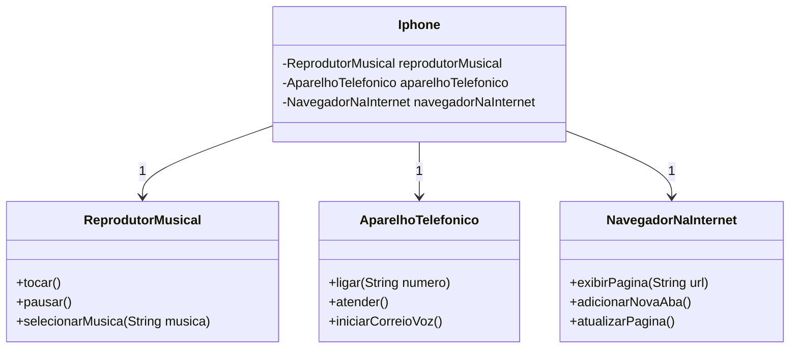

<h1 align="center">
 DESAFIO DIO MODELAGEM IPHONE
 <h3 align ="center" >Projeto de modelagem de diagrama UML do Iphone ☕</h3> 
</h1>

### 📕 SOBRE 
**Funcionalidades a Modelar**
- Reprodutor Musical
Métodos: tocar(), pausar(), selecionarMusica(String musica)
- Aparelho Telefônico
Métodos: ligar(String numero), atender(), iniciarCorreioVoz()
- Navegador na Internet
Métodos: exibirPagina(String url), adicionarNovaAba(), atualizarPagina()

### 🧜‍♀️ **DIAGRAMA(Mermaid)**: 

